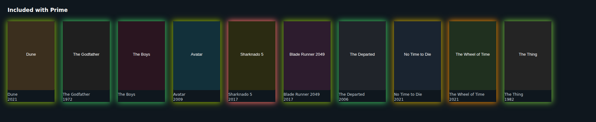

# Prime Rating Glow

A Chrome extension that tints every tile on `amazon.co.uk/gp/video/*` with a
`box-shadow` glow coloured by its IMDb rating — red at 5.0, through amber, to
green at 8.5.



Ratings come from a local copy of the IMDb dataset dumps held in IndexedDB, with
OMDb as a fallback. Nothing is scraped.

---

## Install

```bash
git clone https://github.com/fahadhewad/prime-movie-rating-visual
cd prime-movie-rating-visual
```

Then in Chrome: `chrome://extensions` → enable **Developer mode** → **Load
unpacked** → pick this folder. No build step; the source loads as-is.

Open the extension's options page and set up a ratings source before it will do
anything.

## Getting ratings

### The local dataset (recommended)

IMDb publishes daily [dataset dumps](https://developer.imdb.com/non-commercial-datasets/).
The options page downloads `title.ratings.tsv.gz` and `title.basics.tsv.gz`,
joins them, and writes the result into IndexedDB.

After that every lookup is a local indexed read: no network, no rate limit, no
per-title cost. It takes a few minutes and reads about a gigabyte, so **leave
the options tab open while it runs**.

The dumps are licensed for personal and non-commercial use only. That covers
running this on your own machine; it does not cover redistributing the data or
shipping it inside a product.

Already have the files? **Import from local files…** takes them straight off
disk, no download.

The `Minimum votes` setting trades coverage for size:

| Minimum votes | Coverage |
|---|---|
| 25 | everything, including the long tail |
| 100 (default) | comfortably covers the storefront |
| 1000 | small and fast, misses obscure titles |

The options page reports the exact count after an import.

### OMDb

[OMDb](https://www.omdbapi.com/apikey.aspx) gives a free key worth about 1000
lookups a day. Paste it into the options page; it lives in
`chrome.storage.local` and is never written to disk in this repo.

The extension keeps its own daily counter and stops before the API cuts it off,
resetting at UTC midnight. With the `dataset` source selected, OMDb is only
consulted for titles the dump does not have.

## How it works

### Reading tiles

Prime Video's markup is generated and churns constantly, so nothing here depends
on a single selector. The one durable fact is that every tile is built around an
artwork `` inside a link to `/gp/video/detail/`, so images are the anchor
and the card element is found by walking outwards until the first ancestor that
holds more than one image.

Titles are read from `alt`, then `aria-label`, then a handful of fallbacks, and
then cleaned: `"Watch The Boys - Season 3 | Prime Video"` becomes `The Boys`
with `season: 3`.

### Matching, and admitting when it fails

A tile gives you a title and usually no year, which makes remakes genuinely
ambiguous — "The Thing" is a 1982 classic, a 2011 prequel and several shorts.

Every candidate is scored on key match, year distance, title type and vote
count, and the winner comes back with a **confidence** value. Rather than
picking the most popular row and pretending to be sure:

- confident matches glow at full strength
- uncertain ones fade in proportion to how unsure we are
- anything below `minConfidence` is not drawn at all

So a tile carrying a year glows solidly, and a bare "The Thing" glows faintly —
the ambiguity is visible instead of hidden. Hovering any tile shows what it
matched against.

Where a year *is* available — parenthesised in the label, or rendered in the
card — it pins the match exactly. An ASIN from the detail link is used as the
cache key when present, so a title is disambiguated at most once ever.

### Keeping up with the DOM

Three pieces, in order of importance:

- **`MutationObserver`** on `document.body`, debounced to 150ms. Carousels lazy
  load, and Prime is a single-page app, so tiles keep arriving long after load.
  A per-mutation scan would cost more than the lookups do.
- **`IntersectionObserver`** with a 300px margin on all four sides. A storefront
  page holds hundreds of tiles and shows a dozen; only what is near the viewport
  is ever looked up. The margin is on all sides because rows scroll sideways.
- **Batching**, because a row scrolling into view yields twenty tiles in one
  frame, and that should be one message rather than twenty.

Results are cached in `chrome.storage.local` — misses too, with a shorter TTL,
since without that every unmatchable tile would burn a lookup on every page
view. Concurrent requests for the same title collapse into one.

### Colour

The ramp is a three-stop table, not a straight hue interpolation: a naive
0°→120° lerp puts pure yellow at the midpoint and skips amber almost entirely.
Pinning an explicit amber stop gives the lower half more room, so a 6.5 looks
meaningfully different from a 7.5.

OKLCH is used where supported, since equal hue steps there look equally spaced,
with HSL as the fallback.

## Layout

```
manifest.json              MV3 manifest
src/shared/                pure logic - no DOM, no chrome APIs, unit tested
  normalise.js               title cleaning, year/season extraction, key building
  match.js                   candidate scoring, disambiguation, confidence
  color.js                   the rating -> colour ramp
  cache.js                   TTL + LRU lookup cache
  tsv.js, ratings-index.js   dataset parsing and the compact join table
src/content/               tile discovery, observers, painting
src/background/            service worker, resolver chain, providers
src/db/                    IndexedDB schema and the import pipeline
tools/                     icon generator, browser smoke test
```

The import runs on the **options page**, not in the service worker: MV3 workers
are killed after ~30s idle and can be torn down mid-task, and this job runs for
minutes.

The join runs ratings-first for the same reason — 11M `title.basics` rows
against 1.5M ratings, where 11M individual IndexedDB reads would take hours. The
ratings side is held in two parallel `Uint32Array`s with a binary search, which
costs ~12MB instead of the ~100MB a `Map` would need.

Content scripts cannot be ES modules, so `bootstrap.js` dynamically imports
`main.js`. That keeps every module importable by the tests with no bundler in
the project.

## Development

```bash
npm test     # unit tests for the pure logic - no dependencies
npm run smoke   # end-to-end in a real Chromium (needs playwright-core)
npm run icons   # regenerate icons from the colour ramp
```

`npm test` runs on Node's built-in test runner and needs nothing installed.

`npm run smoke` loads the extension into Chromium, imports a miniature dataset
through the real pipeline, serves a fixture at the real storefront URL so the
manifest's match pattern applies, and checks that glows actually land. Given how
often Prime's markup changes, that is the test that matters. It skips itself
cleanly if `playwright-core` is not installed.

## Known limits

- A carousel row with `overflow: hidden` clips the outer halo. Forcing
  `overflow` or `position` onto Prime's containers breaks their layout far more
  visibly than a slightly cropped glow, so this is left alone.
- Only `amazon.co.uk/gp/video/*` matches. For `primevideo.com`, add it to
  `content_scripts[0].matches` and `web_accessible_resources[0].matches`.
- Episode-level tiles resolve to their parent series.
- Ratings shift over time; cached hits are re-checked after 30 days by default.

## Licence

MIT — see [LICENSE](LICENSE).

IMDb datasets are © IMDb.com, Inc., made available for personal and
non-commercial use. This project neither redistributes nor bundles them; it
downloads them into your own browser at your request.
